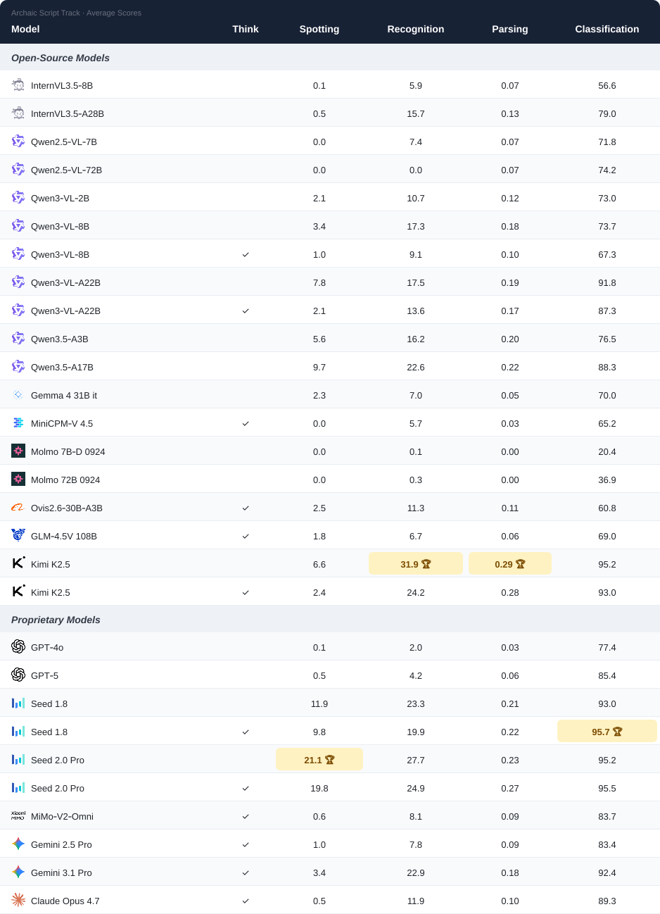
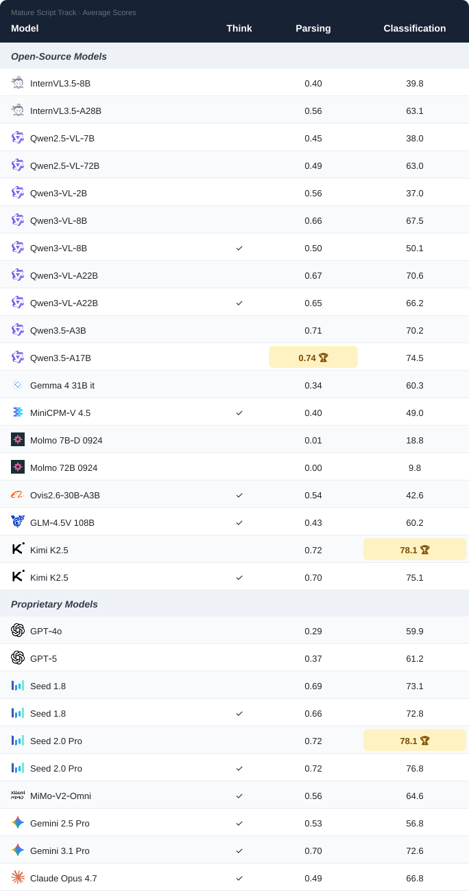

# Chronicles-OCR

**A Cross-Temporal Perception Benchmark for the Evolutionary Trajectory of Chinese Characters**

<p align="center">
  <a href="README_ZH.md">中文版</a> •
  <a href="https://arxiv.org/abs/2605.11960">Paper</a> •
  <strong><a href="#-leaderboard">Leaderboard</a></strong> •
  <a href="https://github.com/VirtualLUOUCAS/Chronicles-OCR">GitHub</a> •
  <a href="https://huggingface.co/datasets/VirtualLUO/Chronicles-OCR">HuggingFace</a> •
  <a href="https://modelscope.cn/datasets/VirtualLUO/Chronicles-OCR">ModelScope</a>
</p>

## Overview

**Chronicles-OCR** is the first comprehensive benchmark specifically designed to evaluate the cross-temporal visual perception capabilities of VLLMs across the complete evolutionary trajectory of Chinese characters — the **"Seven Chinese Scripts"**.

Curated in collaboration with top-tier institutional domain experts (the Key Laboratory of Oracle Bone Inscription Information Processing at Anyang Normal University and the Palace Museum), the dataset comprises **2,800 strictly balanced images** encompassing highly diverse physical media, ranging from tortoise shells to paper-based calligraphy.

<p align="center">
  
</p>

## The Seven Chinese Scripts

The **"Seven Chinese Scripts" (汉字七体)** refer to the seven canonical script forms that emerged throughout the evolution of Chinese characters over more than 5,000 years:

1. **Oracle Bone Script (甲骨文)** — The earliest known mature Chinese writing system, carved on tortoise shells and animal bones during the Shang Dynasty. Characters feature strong pictographic qualities with thin, angular strokes and unstandardized layouts.
2. **Bronze Script (金文)** — Cast on ceremonial bronze vessels during the Shang and Zhou Dynasties. Strokes are thicker and rounder, with progressively more regularized and aesthetic structures.
3. **Seal Script (篆书)** — Standardized after the Qin unification of China. Features pronounced curvilinear symmetry and fixed structural patterns, marking the transition from regional variants to a unified writing system.
4. **Clerical Script (隶书)** — Emerged during the Qin–Han transition, flattening characters and replacing curves with angular strokes. Represents a critical turning point — the watershed between ancient and modern Chinese characters.
5. **Regular Script (楷书)** — Established in the late Han and Wei-Jin periods with strict square structures and standardized strokes. Remains the dominant formal script to this day.
6. **Cursive Script (草书)** — Developed for rapid, informal writing. Uses continuous, connected strokes that often eliminate independent character boundaries, ranging from the restrained Zhang Cao to the unbounded Kuang Cao.
7. **Running Script (行书)** — A fluid yet legible intermediate style between Regular and Cursive scripts, widely used from the Eastern Han Dynasty onward. Wang Xizhi's _Preface to the Orchid Pavilion_ is its most celebrated exemplar.

Among these, the first five (Oracle Bone → Regular) successively served as formal writing systems in their respective eras, while Cursive and Running scripts developed primarily as auxiliary styles for informal and rapid writing.

## Benchmark Statistics

| Item            | Details                                                                         |
| --------------- | ------------------------------------------------------------------------------- |
| Total Images    | 2,800 (400 per script × 7 scripts)                                              |
| Script Coverage | All Seven Chinese Scripts                                                       |
| Annotation      | Stage-Adaptive: character-level for archaic, paragraph-level for mature scripts |
| Expert Partners | Anyang Normal University (Oracle Bone), Palace Museum (Clerical–Cursive)        |
| Tasks           | 4 evaluation tasks                                                              |

## Evaluation Tasks

| Task                                       | Short Name     | Scope                     | Metric                |
| ------------------------------------------ | -------------- | ------------------------- | --------------------- |
| Cross-period Character Spotting            | Spotting       | Oracle Bone, Bronze, Seal | F1 @ IoU ≥ 0.75       |
| Fine-grained Archaic Character Recognition | Recognition    | Oracle Bone, Bronze, Seal | Exact-match Accuracy  |
| Ancient Text Parsing                       | Parsing        | All Seven Scripts         | 1 − NED (Levenshtein) |
| Script Classification                      | Classification | All Seven Scripts         | Accuracy              |

## 🏆 Leaderboard

Chronicles-OCR maintains two complementary multi-task leaderboards. The archaic-script track covers Spotting, Recognition, Parsing, and Classification, while the mature-script track covers Parsing and Classification.

> **Leaderboard Updates.** We will regularly expand the leaderboard with evaluations of newly released models. Developers are also welcome to submit model inference results to [ligengluo@iie.ac.cn](mailto:ligengluo@iie.ac.cn) for more timely inclusion. We will adapt the submitted results to the official evaluation protocol, verify the metrics, and update the leaderboard.
>
> 🏆 marks the best average result for each task across all models. Tied results share the trophy. Results with and without thinking mode are treated as separate model configurations.

### Archaic Script Leaderboard

<p align="center">
  
</p>

<details>
<summary><strong>View detailed per-script results</strong></summary>

<table>
  <thead>
    <tr>
      <th width="210" rowspan="2" align="left">Model</th>
      <th rowspan="2" align="center">Think</th>
      <th colspan="4" align="center">Average</th>
      <th colspan="4" align="center">Oracle Bone</th>
      <th colspan="4" align="center">Bronze</th>
      <th colspan="4" align="center">Seal</th>
    </tr>
    <tr>
      <th align="center">Spot.</th>
      <th align="center">Fine.</th>
      <th align="center">Pars.</th>
      <th align="center">Class.</th>
      <th align="center">Spot.</th>
      <th align="center">Fine.</th>
      <th align="center">Pars.</th>
      <th align="center">Class.</th>
      <th align="center">Spot.</th>
      <th align="center">Fine.</th>
      <th align="center">Pars.</th>
      <th align="center">Class.</th>
      <th align="center">Spot.</th>
      <th align="center">Fine.</th>
      <th align="center">Pars.</th>
      <th align="center">Class.</th>
    </tr>
  </thead>
  <tbody>
    <tr><td colspan="18" align="left"><em><strong>Open-Source Models</strong></em></td></tr>
    <tr>
      <td width="210" align="left"><sub>&#8288;&nbsp;InternVL3.5&#8209;8B</sub></td>
      <td align="center"></td>
      <td align="center">0.1</td>
      <td align="center">5.9</td>
      <td align="center">0.07</td>
      <td align="center">56.6</td>
      <td align="center">0.0</td>
      <td align="center">1.0</td>
      <td align="center">0.01</td>
      <td align="center">85.8</td>
      <td align="center">0.0</td>
      <td align="center">2.2</td>
      <td align="center">0.03</td>
      <td align="center">7.0</td>
      <td align="center">0.2</td>
      <td align="center">14.5</td>
      <td align="center">0.17</td>
      <td align="center">77.0</td>
    </tr>
    <tr>
      <td width="210" align="left"><sub>&#8288;&nbsp;InternVL3.5&#8209;A28B</sub></td>
      <td align="center"></td>
      <td align="center">0.5</td>
      <td align="center">15.7</td>
      <td align="center">0.13</td>
      <td align="center">79.0</td>
      <td align="center">0.0</td>
      <td align="center">2.5</td>
      <td align="center">0.02</td>
      <td align="center">96.3</td>
      <td align="center">0.4</td>
      <td align="center">7.8</td>
      <td align="center">0.08</td>
      <td align="center">79.2</td>
      <td align="center">1.0</td>
      <td align="center">36.8</td>
      <td align="center">0.29</td>
      <td align="center">61.5</td>
    </tr>
    <tr>
      <td width="210" align="left"><sub>&#8288;&nbsp;Qwen2.5&#8209;VL&#8209;7B</sub></td>
      <td align="center"></td>
      <td align="center">0.0</td>
      <td align="center">7.4</td>
      <td align="center">0.07</td>
      <td align="center">71.8</td>
      <td align="center">0.0</td>
      <td align="center">4.0</td>
      <td align="center">0.03</td>
      <td align="center">93.8</td>
      <td align="center">0.0</td>
      <td align="center">4.5</td>
      <td align="center">0.04</td>
      <td align="center">22.5</td>
      <td align="center">0.0</td>
      <td align="center">13.8</td>
      <td align="center">0.14</td>
      <td align="center">99.2</td>
    </tr>
    <tr>
      <td width="210" align="left"><sub>&#8288;&nbsp;Qwen2.5&#8209;VL&#8209;72B</sub></td>
      <td align="center"></td>
      <td align="center">0.0</td>
      <td align="center">0.0</td>
      <td align="center">0.07</td>
      <td align="center">74.2</td>
      <td align="center">0.0</td>
      <td align="center">0.0</td>
      <td align="center">0.01</td>
      <td align="center">98.0</td>
      <td align="center">0.0</td>
      <td align="center">0.0</td>
      <td align="center">0.04</td>
      <td align="center">26.0</td>
      <td align="center">0.0</td>
      <td align="center">0.0</td>
      <td align="center">0.16</td>
      <td align="center">98.5</td>
    </tr>
    <tr>
      <td width="210" align="left"><sub>&#8288;&nbsp;Qwen3&#8209;VL&#8209;2B</sub></td>
      <td align="center"></td>
      <td align="center">2.1</td>
      <td align="center">10.7</td>
      <td align="center">0.12</td>
      <td align="center">73.0</td>
      <td align="center">0.0</td>
      <td align="center">1.4</td>
      <td align="center">0.00</td>
      <td align="center">96.6</td>
      <td align="center">0.8</td>
      <td align="center">6.8</td>
      <td align="center">0.06</td>
      <td align="center">36.5</td>
      <td align="center">5.7</td>
      <td align="center">24.0</td>
      <td align="center">0.31</td>
      <td align="center">85.8</td>
    </tr>
    <tr>
      <td width="210" align="left"><sub>&#8288;&nbsp;Qwen3&#8209;VL&#8209;8B</sub></td>
      <td align="center"></td>
      <td align="center">3.4</td>
      <td align="center">17.3</td>
      <td align="center">0.18</td>
      <td align="center">73.7</td>
      <td align="center">0.2</td>
      <td align="center">3.4</td>
      <td align="center">0.01</td>
      <td align="center">98.6</td>
      <td align="center">2.5</td>
      <td align="center">11.0</td>
      <td align="center">0.10</td>
      <td align="center">24.0</td>
      <td align="center">7.5</td>
      <td align="center">37.5</td>
      <td align="center">0.42</td>
      <td align="center">98.5</td>
    </tr>
    <tr>
      <td width="210" align="left"><sub>&#8288;&nbsp;Qwen3&#8209;VL&#8209;8B</sub></td>
      <td align="center">✓</td>
      <td align="center">1.0</td>
      <td align="center">9.1</td>
      <td align="center">0.10</td>
      <td align="center">67.3</td>
      <td align="center">0.0</td>
      <td align="center">3.7</td>
      <td align="center">0.04</td>
      <td align="center">97.7</td>
      <td align="center">0.2</td>
      <td align="center">7.0</td>
      <td align="center">0.05</td>
      <td align="center">31.8</td>
      <td align="center">2.8</td>
      <td align="center">16.8</td>
      <td align="center">0.20</td>
      <td align="center">72.5</td>
    </tr>
    <tr>
      <td width="210" align="left"><sub>&#8288;&nbsp;Qwen3&#8209;VL&#8209;A22B</sub></td>
      <td align="center"></td>
      <td align="center">7.8</td>
      <td align="center">17.5</td>
      <td align="center">0.19</td>
      <td align="center">91.8</td>
      <td align="center">0.3</td>
      <td align="center">5.4</td>
      <td align="center">0.02</td>
      <td align="center">99.2</td>
      <td align="center">6.5</td>
      <td align="center">12.2</td>
      <td align="center">0.12</td>
      <td align="center">80.2</td>
      <td align="center">16.6</td>
      <td align="center">35.0</td>
      <td align="center">0.43</td>
      <td align="center">96.0</td>
    </tr>
    <tr>
      <td width="210" align="left"><sub>&#8288;&nbsp;Qwen3&#8209;VL&#8209;A22B</sub></td>
      <td align="center">✓</td>
      <td align="center">2.1</td>
      <td align="center">13.6</td>
      <td align="center">0.17</td>
      <td align="center">87.3</td>
      <td align="center">0.1</td>
      <td align="center">4.2</td>
      <td align="center">0.04</td>
      <td align="center">98.0</td>
      <td align="center">0.9</td>
      <td align="center">10.2</td>
      <td align="center">0.11</td>
      <td align="center">66.8</td>
      <td align="center">5.3</td>
      <td align="center">26.2</td>
      <td align="center">0.38</td>
      <td align="center">97.2</td>
    </tr>
    <tr>
      <td width="210" align="left"><sub>&#8288;&nbsp;Qwen3.5&#8209;A3B</sub></td>
      <td align="center"></td>
      <td align="center">5.6</td>
      <td align="center">16.2</td>
      <td align="center">0.20</td>
      <td align="center">76.5</td>
      <td align="center">0.2</td>
      <td align="center">5.1</td>
      <td align="center">0.03</td>
      <td align="center">99.7</td>
      <td align="center">5.3</td>
      <td align="center">11.5</td>
      <td align="center">0.12</td>
      <td align="center">30.0</td>
      <td align="center">11.2</td>
      <td align="center">32.0</td>
      <td align="center">0.45</td>
      <td align="center"><strong>99.8</strong></td>
    </tr>
    <tr>
      <td width="210" align="left"><sub>&#8288;&nbsp;Qwen3.5&#8209;A17B</sub></td>
      <td align="center"></td>
      <td align="center">9.7</td>
      <td align="center">22.6</td>
      <td align="center">0.22</td>
      <td align="center">88.3</td>
      <td align="center">0.5</td>
      <td align="center">9.1</td>
      <td align="center">0.03</td>
      <td align="center">99.7</td>
      <td align="center">9.2</td>
      <td align="center">17.5</td>
      <td align="center">0.13</td>
      <td align="center">67.2</td>
      <td align="center">19.4</td>
      <td align="center">41.3</td>
      <td align="center">0.50</td>
      <td align="center">98.0</td>
    </tr>
    <tr>
      <td width="210" align="left"><sub>&#8288;&nbsp;Gemma&nbsp;4&nbsp;31B&nbsp;it</sub></td>
      <td align="center"></td>
      <td align="center">2.3</td>
      <td align="center">7.0</td>
      <td align="center">0.05</td>
      <td align="center">70.0</td>
      <td align="center">0.0</td>
      <td align="center">3.1</td>
      <td align="center">0.01</td>
      <td align="center">72.6</td>
      <td align="center">1.0</td>
      <td align="center">6.5</td>
      <td align="center">0.03</td>
      <td align="center">74.8</td>
      <td align="center">6.0</td>
      <td align="center">11.2</td>
      <td align="center">0.10</td>
      <td align="center">62.7</td>
    </tr>
    <tr>
      <td width="210" align="left"><sub>&#8288;&nbsp;MiniCPM&#8209;V&nbsp;4.5</sub></td>
      <td align="center">✓</td>
      <td align="center">0.0</td>
      <td align="center">5.7</td>
      <td align="center">0.03</td>
      <td align="center">65.2</td>
      <td align="center">0.0</td>
      <td align="center">2.5</td>
      <td align="center">0.01</td>
      <td align="center">95.2</td>
      <td align="center">0.0</td>
      <td align="center">5.5</td>
      <td align="center">0.03</td>
      <td align="center">18.0</td>
      <td align="center">0.1</td>
      <td align="center">9.0</td>
      <td align="center">0.04</td>
      <td align="center">82.5</td>
    </tr>
    <tr>
      <td width="210" align="left"><sub>&#8288;&nbsp;Molmo&nbsp;7B&#8209;D&nbsp;0924</sub></td>
      <td align="center"></td>
      <td align="center">0.0</td>
      <td align="center">0.1</td>
      <td align="center">0.00</td>
      <td align="center">20.4</td>
      <td align="center">0.0</td>
      <td align="center">0.0</td>
      <td align="center">0.01</td>
      <td align="center">40.8</td>
      <td align="center">0.0</td>
      <td align="center">0.2</td>
      <td align="center">0.00</td>
      <td align="center">0.0</td>
      <td align="center">0.0</td>
      <td align="center">0.0</td>
      <td align="center">0.00</td>
      <td align="center">20.5</td>
    </tr>
    <tr>
      <td width="210" align="left"><sub>&#8288;&nbsp;Molmo&nbsp;72B&nbsp;0924</sub></td>
      <td align="center"></td>
      <td align="center">0.0</td>
      <td align="center">0.3</td>
      <td align="center">0.00</td>
      <td align="center">36.9</td>
      <td align="center">0.0</td>
      <td align="center">0.5</td>
      <td align="center">0.00</td>
      <td align="center">28.0</td>
      <td align="center">0.0</td>
      <td align="center">0.5</td>
      <td align="center">0.00</td>
      <td align="center">0.8</td>
      <td align="center">0.0</td>
      <td align="center">0.0</td>
      <td align="center">0.00</td>
      <td align="center">82.0</td>
    </tr>
    <tr>
      <td width="210" align="left"><sub>&#8288;&nbsp;Ovis2.6&#8209;30B&#8209;A3B</sub></td>
      <td align="center">✓</td>
      <td align="center">2.5</td>
      <td align="center">11.3</td>
      <td align="center">0.11</td>
      <td align="center">60.8</td>
      <td align="center">0.1</td>
      <td align="center">2.0</td>
      <td align="center">0.02</td>
      <td align="center">89.8</td>
      <td align="center">0.7</td>
      <td align="center">7.5</td>
      <td align="center">0.06</td>
      <td align="center">13.5</td>
      <td align="center">6.8</td>
      <td align="center">24.5</td>
      <td align="center">0.25</td>
      <td align="center">79.0</td>
    </tr>
    <tr>
      <td width="210" align="left"><sub>&#8288;&nbsp;GLM&#8209;4.5V&nbsp;108B</sub></td>
      <td align="center">✓</td>
      <td align="center">1.8</td>
      <td align="center">6.7</td>
      <td align="center">0.06</td>
      <td align="center">69.0</td>
      <td align="center">0.1</td>
      <td align="center">4.2</td>
      <td align="center">0.04</td>
      <td align="center"><strong>100</strong></td>
      <td align="center">2.0</td>
      <td align="center">6.5</td>
      <td align="center">0.05</td>
      <td align="center">15.5</td>
      <td align="center">3.3</td>
      <td align="center">9.2</td>
      <td align="center">0.10</td>
      <td align="center">91.5</td>
    </tr>
    <tr>
      <td width="210" align="left"><sub>&#8288;&nbsp;Kimi&nbsp;K2.5</sub></td>
      <td align="center"></td>
      <td align="center">6.6</td>
      <td align="center"><strong>31.9 🏆</strong></td>
      <td align="center"><strong>0.29 🏆</strong></td>
      <td align="center">95.2</td>
      <td align="center">0.1</td>
      <td align="center">11.5</td>
      <td align="center">0.06</td>
      <td align="center"><strong>100</strong></td>
      <td align="center">7.5</td>
      <td align="center">25.8</td>
      <td align="center">0.19</td>
      <td align="center">90.0</td>
      <td align="center">12.5</td>
      <td align="center"><strong>58.5</strong></td>
      <td align="center"><strong>0.60</strong></td>
      <td align="center">95.5</td>
    </tr>
    <tr>
      <td width="210" align="left"><sub>&#8288;&nbsp;Kimi&nbsp;K2.5</sub></td>
      <td align="center">✓</td>
      <td align="center">2.4</td>
      <td align="center">24.2</td>
      <td align="center">0.28</td>
      <td align="center">93.0</td>
      <td align="center">0.0</td>
      <td align="center">10.2</td>
      <td align="center"><strong>0.07</strong></td>
      <td align="center">99.8</td>
      <td align="center">1.2</td>
      <td align="center">17.5</td>
      <td align="center">0.20</td>
      <td align="center">85.8</td>
      <td align="center">6.0</td>
      <td align="center">44.8</td>
      <td align="center">0.57</td>
      <td align="center">93.5</td>
    </tr>
    <tr><td colspan="18" align="left"><em><strong>Proprietary Models</strong></em></td></tr>
    <tr>
      <td width="210" align="left"><sub>&#8288;&nbsp;GPT&#8209;4o</sub></td>
      <td align="center"></td>
      <td align="center">0.1</td>
      <td align="center">2.0</td>
      <td align="center">0.03</td>
      <td align="center">77.4</td>
      <td align="center">0.0</td>
      <td align="center">0.5</td>
      <td align="center">0.01</td>
      <td align="center">96.5</td>
      <td align="center">0.0</td>
      <td align="center">1.0</td>
      <td align="center">0.02</td>
      <td align="center">46.8</td>
      <td align="center">0.3</td>
      <td align="center">4.5</td>
      <td align="center">0.06</td>
      <td align="center">89.0</td>
    </tr>
    <tr>
      <td width="210" align="left"><sub>&#8288;&nbsp;GPT&#8209;5</sub></td>
      <td align="center"></td>
      <td align="center">0.5</td>
      <td align="center">4.2</td>
      <td align="center">0.06</td>
      <td align="center">85.4</td>
      <td align="center">0.0</td>
      <td align="center">4.0</td>
      <td align="center">0.01</td>
      <td align="center">98.2</td>
      <td align="center">0.0</td>
      <td align="center">4.0</td>
      <td align="center">0.04</td>
      <td align="center">60.5</td>
      <td align="center">1.6</td>
      <td align="center">4.5</td>
      <td align="center">0.12</td>
      <td align="center">97.5</td>
    </tr>
    <tr>
      <td width="210" align="left"><sub>&#8288;&nbsp;Seed&nbsp;1.8</sub></td>
      <td align="center"></td>
      <td align="center">11.9</td>
      <td align="center">23.3</td>
      <td align="center">0.21</td>
      <td align="center">93.0</td>
      <td align="center">0.4</td>
      <td align="center">9.2</td>
      <td align="center">0.04</td>
      <td align="center">99.5</td>
      <td align="center">9.4</td>
      <td align="center">15.8</td>
      <td align="center">0.17</td>
      <td align="center">80.5</td>
      <td align="center">26.7</td>
      <td align="center">45.0</td>
      <td align="center">0.42</td>
      <td align="center">99.0</td>
    </tr>
    <tr>
      <td width="210" align="left"><sub>&#8288;&nbsp;Seed&nbsp;1.8</sub></td>
      <td align="center">✓</td>
      <td align="center">9.8</td>
      <td align="center">19.9</td>
      <td align="center">0.22</td>
      <td align="center"><strong>95.7 🏆</strong></td>
      <td align="center">0.4</td>
      <td align="center">8.8</td>
      <td align="center">0.05</td>
      <td align="center">99.5</td>
      <td align="center">5.8</td>
      <td align="center">14.8</td>
      <td align="center">0.18</td>
      <td align="center">90.0</td>
      <td align="center">23.3</td>
      <td align="center">36.2</td>
      <td align="center">0.43</td>
      <td align="center">97.5</td>
    </tr>
    <tr>
      <td width="210" align="left"><sub>&#8288;&nbsp;Seed&nbsp;2.0&nbsp;Pro</sub></td>
      <td align="center"></td>
      <td align="center"><strong>21.1 🏆</strong></td>
      <td align="center">27.7</td>
      <td align="center">0.23</td>
      <td align="center">95.2</td>
      <td align="center"><strong>3.0</strong></td>
      <td align="center">11.0</td>
      <td align="center">0.04</td>
      <td align="center">99.5</td>
      <td align="center"><strong>19.9</strong></td>
      <td align="center"><strong>30.8</strong></td>
      <td align="center">0.22</td>
      <td align="center"><strong>92.2</strong></td>
      <td align="center"><strong>40.7</strong></td>
      <td align="center">41.5</td>
      <td align="center">0.43</td>
      <td align="center">93.8</td>
    </tr>
    <tr>
      <td width="210" align="left"><sub>&#8288;&nbsp;Seed&nbsp;2.0&nbsp;Pro</sub></td>
      <td align="center">✓</td>
      <td align="center">19.8</td>
      <td align="center">24.9</td>
      <td align="center">0.27</td>
      <td align="center">95.5</td>
      <td align="center">2.4</td>
      <td align="center">11.2</td>
      <td align="center">0.05</td>
      <td align="center">99.8</td>
      <td align="center">17.8</td>
      <td align="center">26.0</td>
      <td align="center"><strong>0.26</strong></td>
      <td align="center"><strong>92.2</strong></td>
      <td align="center">39.1</td>
      <td align="center">37.5</td>
      <td align="center">0.49</td>
      <td align="center">94.5</td>
    </tr>
    <tr>
      <td width="210" align="left"><sub>&#8288;&nbsp;MiMo&#8209;V2&#8209;Omni</sub></td>
      <td align="center">✓</td>
      <td align="center">0.6</td>
      <td align="center">8.1</td>
      <td align="center">0.09</td>
      <td align="center">83.7</td>
      <td align="center">0.0</td>
      <td align="center">6.5</td>
      <td align="center">0.05</td>
      <td align="center">99.5</td>
      <td align="center">0.2</td>
      <td align="center">8.0</td>
      <td align="center">0.07</td>
      <td align="center">58.5</td>
      <td align="center">1.5</td>
      <td align="center">9.8</td>
      <td align="center">0.15</td>
      <td align="center">93.0</td>
    </tr>
    <tr>
      <td width="210" align="left"><sub>&#8288;&nbsp;Gemini&nbsp;2.5&nbsp;Pro</sub></td>
      <td align="center">✓</td>
      <td align="center">1.0</td>
      <td align="center">7.8</td>
      <td align="center">0.09</td>
      <td align="center">83.4</td>
      <td align="center">0.0</td>
      <td align="center">5.8</td>
      <td align="center">0.05</td>
      <td align="center">99.5</td>
      <td align="center">0.2</td>
      <td align="center">7.0</td>
      <td align="center">0.06</td>
      <td align="center">80.5</td>
      <td align="center">2.8</td>
      <td align="center">10.8</td>
      <td align="center">0.14</td>
      <td align="center">70.2</td>
    </tr>
    <tr>
      <td width="210" align="left"><sub>&#8288;&nbsp;Gemini&nbsp;3.1&nbsp;Pro</sub></td>
      <td align="center">✓</td>
      <td align="center">3.4</td>
      <td align="center">22.9</td>
      <td align="center">0.18</td>
      <td align="center">92.4</td>
      <td align="center">0.0</td>
      <td align="center"><strong>14.0</strong></td>
      <td align="center">0.06</td>
      <td align="center">99.5</td>
      <td align="center">2.5</td>
      <td align="center">22.5</td>
      <td align="center">0.18</td>
      <td align="center">84.5</td>
      <td align="center">7.8</td>
      <td align="center">32.2</td>
      <td align="center">0.32</td>
      <td align="center">93.2</td>
    </tr>
    <tr>
      <td width="210" align="left"><sub>&#8288;&nbsp;Claude&nbsp;Opus&nbsp;4.7</sub></td>
      <td align="center">✓</td>
      <td align="center">0.5</td>
      <td align="center">11.9</td>
      <td align="center">0.10</td>
      <td align="center">89.3</td>
      <td align="center">0.0</td>
      <td align="center">4.8</td>
      <td align="center">0.04</td>
      <td align="center">93.8</td>
      <td align="center">0.1</td>
      <td align="center">9.5</td>
      <td align="center">0.05</td>
      <td align="center">80.5</td>
      <td align="center">1.4</td>
      <td align="center">21.5</td>
      <td align="center">0.21</td>
      <td align="center">93.8</td>
    </tr>
  </tbody>
</table>

</details>

> **OB** = Oracle Bone, **Br** = Bronze, **Se** = Seal. **Bold** = best, scores are H-mean (Spot.), Accuracy (Fine./Class.), NED (Pars.).

### Mature Script Leaderboard

<p align="center">
  
</p>

<details>
<summary><strong>View detailed per-script results</strong></summary>

<table>
  <thead>
    <tr>
      <th width="210" rowspan="2" align="left">Model</th>
      <th rowspan="2" align="center">Think</th>
      <th colspan="2" align="center">Average</th>
      <th colspan="2" align="center">Clerical</th>
      <th colspan="2" align="center">Regular</th>
      <th colspan="2" align="center">Running</th>
      <th colspan="2" align="center">Cursive</th>
    </tr>
    <tr>
      <th align="center">Pars.</th>
      <th align="center">Class.</th>
      <th align="center">Pars.</th>
      <th align="center">Class.</th>
      <th align="center">Pars.</th>
      <th align="center">Class.</th>
      <th align="center">Pars.</th>
      <th align="center">Class.</th>
      <th align="center">Pars.</th>
      <th align="center">Class.</th>
    </tr>
  </thead>
  <tbody>
    <tr><td colspan="12" align="left"><em><strong>Open-Source Models</strong></em></td></tr>
    <tr>
      <td width="210" align="left"><sub>&#8288;&nbsp;InternVL3.5&#8209;8B</sub></td>
      <td align="center"></td>
      <td align="center">0.40</td>
      <td align="center">39.8</td>
      <td align="center">0.41</td>
      <td align="center">1.8</td>
      <td align="center">0.51</td>
      <td align="center">69.4</td>
      <td align="center">0.38</td>
      <td align="center">52.9</td>
      <td align="center">0.30</td>
      <td align="center">35.0</td>
    </tr>
    <tr>
      <td width="210" align="left"><sub>&#8288;&nbsp;InternVL3.5&#8209;A28B</sub></td>
      <td align="center"></td>
      <td align="center">0.56</td>
      <td align="center">63.1</td>
      <td align="center">0.54</td>
      <td align="center">28.5</td>
      <td align="center">0.69</td>
      <td align="center">85.5</td>
      <td align="center">0.56</td>
      <td align="center">63.3</td>
      <td align="center">0.46</td>
      <td align="center">75.2</td>
    </tr>
    <tr>
      <td width="210" align="left"><sub>&#8288;&nbsp;Qwen2.5&#8209;VL&#8209;7B</sub></td>
      <td align="center"></td>
      <td align="center">0.45</td>
      <td align="center">38.0</td>
      <td align="center">0.54</td>
      <td align="center">8.0</td>
      <td align="center">0.62</td>
      <td align="center">17.0</td>
      <td align="center">0.42</td>
      <td align="center">36.4</td>
      <td align="center">0.21</td>
      <td align="center">90.5</td>
    </tr>
    <tr>
      <td width="210" align="left"><sub>&#8288;&nbsp;Qwen2.5&#8209;VL&#8209;72B</sub></td>
      <td align="center"></td>
      <td align="center">0.49</td>
      <td align="center">63.0</td>
      <td align="center">0.59</td>
      <td align="center">18.0</td>
      <td align="center">0.66</td>
      <td align="center">91.5</td>
      <td align="center">0.46</td>
      <td align="center">56.6</td>
      <td align="center">0.26</td>
      <td align="center">86.0</td>
    </tr>
    <tr>
      <td width="210" align="left"><sub>&#8288;&nbsp;Qwen3&#8209;VL&#8209;2B</sub></td>
      <td align="center"></td>
      <td align="center">0.56</td>
      <td align="center">37.0</td>
      <td align="center">0.61</td>
      <td align="center">5.5</td>
      <td align="center">0.71</td>
      <td align="center">11.8</td>
      <td align="center">0.50</td>
      <td align="center">37.9</td>
      <td align="center">0.42</td>
      <td align="center">93.0</td>
    </tr>
    <tr>
      <td width="210" align="left"><sub>&#8288;&nbsp;Qwen3&#8209;VL&#8209;8B</sub></td>
      <td align="center"></td>
      <td align="center">0.66</td>
      <td align="center">67.5</td>
      <td align="center">0.69</td>
      <td align="center">32.5</td>
      <td align="center">0.77</td>
      <td align="center"><strong>97.2</strong></td>
      <td align="center">0.64</td>
      <td align="center">59.1</td>
      <td align="center">0.56</td>
      <td align="center">81.0</td>
    </tr>
    <tr>
      <td width="210" align="left"><sub>&#8288;&nbsp;Qwen3&#8209;VL&#8209;8B</sub></td>
      <td align="center">✓</td>
      <td align="center">0.50</td>
      <td align="center">50.1</td>
      <td align="center">0.52</td>
      <td align="center">11.2</td>
      <td align="center">0.64</td>
      <td align="center">79.7</td>
      <td align="center">0.51</td>
      <td align="center">53.4</td>
      <td align="center">0.32</td>
      <td align="center">56.2</td>
    </tr>
    <tr>
      <td width="210" align="left"><sub>&#8288;&nbsp;Qwen3&#8209;VL&#8209;A22B</sub></td>
      <td align="center"></td>
      <td align="center">0.67</td>
      <td align="center">70.6</td>
      <td align="center">0.69</td>
      <td align="center">36.5</td>
      <td align="center">0.73</td>
      <td align="center">95.5</td>
      <td align="center">0.66</td>
      <td align="center">68.3</td>
      <td align="center">0.59</td>
      <td align="center">82.0</td>
    </tr>
    <tr>
      <td width="210" align="left"><sub>&#8288;&nbsp;Qwen3&#8209;VL&#8209;A22B</sub></td>
      <td align="center">✓</td>
      <td align="center">0.65</td>
      <td align="center">66.2</td>
      <td align="center">0.67</td>
      <td align="center">31.0</td>
      <td align="center">0.75</td>
      <td align="center">93.5</td>
      <td align="center">0.65</td>
      <td align="center">62.3</td>
      <td align="center">0.54</td>
      <td align="center">78.0</td>
    </tr>
    <tr>
      <td width="210" align="left"><sub>&#8288;&nbsp;Qwen3.5&#8209;A3B</sub></td>
      <td align="center"></td>
      <td align="center">0.71</td>
      <td align="center">70.2</td>
      <td align="center">0.79</td>
      <td align="center">36.8</td>
      <td align="center">0.81</td>
      <td align="center">84.2</td>
      <td align="center">0.68</td>
      <td align="center">75.6</td>
      <td align="center">0.57</td>
      <td align="center">84.2</td>
    </tr>
    <tr>
      <td width="210" align="left"><sub>&#8288;&nbsp;Qwen3.5&#8209;A17B</sub></td>
      <td align="center"></td>
      <td align="center"><strong>0.74 🏆</strong></td>
      <td align="center">74.5</td>
      <td align="center"><strong>0.81</strong></td>
      <td align="center">52.0</td>
      <td align="center">0.81</td>
      <td align="center">81.3</td>
      <td align="center">0.67</td>
      <td align="center">75.3</td>
      <td align="center">0.66</td>
      <td align="center">89.4</td>
    </tr>
    <tr>
      <td width="210" align="left"><sub>&#8288;&nbsp;Gemma&nbsp;4&nbsp;31B&nbsp;it</sub></td>
      <td align="center"></td>
      <td align="center">0.34</td>
      <td align="center">60.3</td>
      <td align="center">0.37</td>
      <td align="center">9.6</td>
      <td align="center">0.56</td>
      <td align="center">81.9</td>
      <td align="center">0.33</td>
      <td align="center">65.0</td>
      <td align="center">0.09</td>
      <td align="center">84.5</td>
    </tr>
    <tr>
      <td width="210" align="left"><sub>&#8288;&nbsp;MiniCPM&#8209;V&nbsp;4.5</sub></td>
      <td align="center">✓</td>
      <td align="center">0.40</td>
      <td align="center">49.0</td>
      <td align="center">0.45</td>
      <td align="center">2.8</td>
      <td align="center">0.61</td>
      <td align="center">87.5</td>
      <td align="center">0.38</td>
      <td align="center">56.9</td>
      <td align="center">0.15</td>
      <td align="center">48.8</td>
    </tr>
    <tr>
      <td width="210" align="left"><sub>&#8288;&nbsp;Molmo&nbsp;7B&#8209;D&nbsp;0924</sub></td>
      <td align="center"></td>
      <td align="center">0.01</td>
      <td align="center">18.8</td>
      <td align="center">0.01</td>
      <td align="center"><strong>70.8</strong></td>
      <td align="center">0.01</td>
      <td align="center">3.0</td>
      <td align="center">0.01</td>
      <td align="center">0.7</td>
      <td align="center">0.01</td>
      <td align="center">0.5</td>
    </tr>
    <tr>
      <td width="210" align="left"><sub>&#8288;&nbsp;Molmo&nbsp;72B&nbsp;0924</sub></td>
      <td align="center"></td>
      <td align="center">0.00</td>
      <td align="center">9.8</td>
      <td align="center">0.00</td>
      <td align="center">6.8</td>
      <td align="center">0.01</td>
      <td align="center">16.5</td>
      <td align="center">0.01</td>
      <td align="center">3.2</td>
      <td align="center">0.00</td>
      <td align="center">12.8</td>
    </tr>
    <tr>
      <td width="210" align="left"><sub>&#8288;&nbsp;Ovis2.6&#8209;30B&#8209;A3B</sub></td>
      <td align="center">✓</td>
      <td align="center">0.54</td>
      <td align="center">42.6</td>
      <td align="center">0.54</td>
      <td align="center">8.5</td>
      <td align="center">0.63</td>
      <td align="center">77.9</td>
      <td align="center">0.57</td>
      <td align="center">71.6</td>
      <td align="center">0.42</td>
      <td align="center">12.2</td>
    </tr>
    <tr>
      <td width="210" align="left"><sub>&#8288;&nbsp;GLM&#8209;4.5V&nbsp;108B</sub></td>
      <td align="center">✓</td>
      <td align="center">0.43</td>
      <td align="center">60.2</td>
      <td align="center">0.45</td>
      <td align="center">11.5</td>
      <td align="center">0.61</td>
      <td align="center">84.5</td>
      <td align="center">0.44</td>
      <td align="center">63.3</td>
      <td align="center">0.23</td>
      <td align="center">81.5</td>
    </tr>
    <tr>
      <td width="210" align="left"><sub>&#8288;&nbsp;Kimi&nbsp;K2.5</sub></td>
      <td align="center"></td>
      <td align="center">0.72</td>
      <td align="center"><strong>78.1 🏆</strong></td>
      <td align="center">0.73</td>
      <td align="center">70.2</td>
      <td align="center">0.78</td>
      <td align="center">78.2</td>
      <td align="center">0.72</td>
      <td align="center">77.8</td>
      <td align="center">0.66</td>
      <td align="center">86.0</td>
    </tr>
    <tr>
      <td width="210" align="left"><sub>&#8288;&nbsp;Kimi&nbsp;K2.5</sub></td>
      <td align="center">✓</td>
      <td align="center">0.70</td>
      <td align="center">75.1</td>
      <td align="center">0.75</td>
      <td align="center">68.5</td>
      <td align="center">0.78</td>
      <td align="center">81.7</td>
      <td align="center">0.60</td>
      <td align="center">65.3</td>
      <td align="center"><strong>0.66</strong></td>
      <td align="center">84.8</td>
    </tr>
    <tr><td colspan="12" align="left"><em><strong>Proprietary Models</strong></em></td></tr>
    <tr>
      <td width="210" align="left"><sub>&#8288;&nbsp;GPT&#8209;4o</sub></td>
      <td align="center"></td>
      <td align="center">0.29</td>
      <td align="center">59.9</td>
      <td align="center">0.35</td>
      <td align="center">20.5</td>
      <td align="center">0.47</td>
      <td align="center">83.0</td>
      <td align="center">0.24</td>
      <td align="center">55.6</td>
      <td align="center">0.12</td>
      <td align="center">80.5</td>
    </tr>
    <tr>
      <td width="210" align="left"><sub>&#8288;&nbsp;GPT&#8209;5</sub></td>
      <td align="center"></td>
      <td align="center">0.37</td>
      <td align="center">61.2</td>
      <td align="center">0.50</td>
      <td align="center">36.2</td>
      <td align="center">0.57</td>
      <td align="center">59.6</td>
      <td align="center">0.21</td>
      <td align="center"><strong>78.1</strong></td>
      <td align="center">0.18</td>
      <td align="center">71.0</td>
    </tr>
    <tr>
      <td width="210" align="left"><sub>&#8288;&nbsp;Seed&nbsp;1.8</sub></td>
      <td align="center"></td>
      <td align="center">0.69</td>
      <td align="center">73.1</td>
      <td align="center">0.68</td>
      <td align="center">45.5</td>
      <td align="center">0.79</td>
      <td align="center">92.7</td>
      <td align="center">0.69</td>
      <td align="center">71.8</td>
      <td align="center">0.61</td>
      <td align="center">82.5</td>
    </tr>
    <tr>
      <td width="210" align="left"><sub>&#8288;&nbsp;Seed&nbsp;1.8</sub></td>
      <td align="center">✓</td>
      <td align="center">0.66</td>
      <td align="center">72.8</td>
      <td align="center">0.69</td>
      <td align="center">48.0</td>
      <td align="center">0.78</td>
      <td align="center">89.2</td>
      <td align="center">0.57</td>
      <td align="center">73.3</td>
      <td align="center">0.60</td>
      <td align="center">80.8</td>
    </tr>
    <tr>
      <td width="210" align="left"><sub>&#8288;&nbsp;Seed&nbsp;2.0&nbsp;Pro</sub></td>
      <td align="center"></td>
      <td align="center">0.72</td>
      <td align="center"><strong>78.1 🏆</strong></td>
      <td align="center">0.75</td>
      <td align="center">60.8</td>
      <td align="center">0.81</td>
      <td align="center">82.0</td>
      <td align="center"><strong>0.73</strong></td>
      <td align="center">77.6</td>
      <td align="center">0.62</td>
      <td align="center">92.2</td>
    </tr>
    <tr>
      <td width="210" align="left"><sub>&#8288;&nbsp;Seed&nbsp;2.0&nbsp;Pro</sub></td>
      <td align="center">✓</td>
      <td align="center">0.72</td>
      <td align="center">76.8</td>
      <td align="center">0.76</td>
      <td align="center">61.8</td>
      <td align="center">0.80</td>
      <td align="center">82.0</td>
      <td align="center">0.65</td>
      <td align="center">74.3</td>
      <td align="center">0.66</td>
      <td align="center">89.0</td>
    </tr>
    <tr>
      <td width="210" align="left"><sub>&#8288;&nbsp;MiMo&#8209;V2&#8209;Omni</sub></td>
      <td align="center">✓</td>
      <td align="center">0.56</td>
      <td align="center">64.6</td>
      <td align="center">0.62</td>
      <td align="center">40.0</td>
      <td align="center">0.71</td>
      <td align="center">80.7</td>
      <td align="center">0.58</td>
      <td align="center">73.3</td>
      <td align="center">0.36</td>
      <td align="center">64.2</td>
    </tr>
    <tr>
      <td width="210" align="left"><sub>&#8288;&nbsp;Gemini&nbsp;2.5&nbsp;Pro</sub></td>
      <td align="center">✓</td>
      <td align="center">0.53</td>
      <td align="center">56.8</td>
      <td align="center">0.67</td>
      <td align="center">33.2</td>
      <td align="center">0.72</td>
      <td align="center">39.6</td>
      <td align="center">0.49</td>
      <td align="center">59.4</td>
      <td align="center">0.23</td>
      <td align="center">95.0</td>
    </tr>
    <tr>
      <td width="210" align="left"><sub>&#8288;&nbsp;Gemini&nbsp;3.1&nbsp;Pro</sub></td>
      <td align="center">✓</td>
      <td align="center">0.70</td>
      <td align="center">72.6</td>
      <td align="center">0.80</td>
      <td align="center">61.0</td>
      <td align="center"><strong>0.83</strong></td>
      <td align="center">62.7</td>
      <td align="center">0.66</td>
      <td align="center">71.1</td>
      <td align="center">0.52</td>
      <td align="center"><strong>95.8</strong></td>
    </tr>
    <tr>
      <td width="210" align="left"><sub>&#8288;&nbsp;Claude&nbsp;Opus&nbsp;4.7</sub></td>
      <td align="center">✓</td>
      <td align="center">0.49</td>
      <td align="center">66.8</td>
      <td align="center">0.53</td>
      <td align="center">50.2</td>
      <td align="center">0.63</td>
      <td align="center">74.4</td>
      <td align="center">0.44</td>
      <td align="center">56.6</td>
      <td align="center">0.38</td>
      <td align="center">86.0</td>
    </tr>
  </tbody>
</table>

</details>

> **Cl** = Clerical, **Re** = Regular, **Ru** = Running, **Cu** = Cursive. **Bold** = best.

## Getting Started

### 1. Setup

```bash
git clone https://github.com/VirtualLUOUCAS/Chronicles-OCR.git
cd Chronicles-OCR
pip install -r requirements.txt
```

### 2. Download Data

Download and place the benchmark data under `data/` from [🤗](https://huggingface.co/datasets/VirtualLUO/Chronicles-OCR) or [🤖](https://modelscope.cn/datasets/VirtualLUO/Chronicles-OCR):

```
data/
├── Chronicles_OCR.jsonl
└── images/
    ├── 甲骨文/    # Oracle Bone
    ├── 金文/      # Bronze Script
    ├── 篆书/      # Seal Script
    ├── 隶书/      # Clerical Script
    ├── 楷书/      # Regular Script
    ├── 行书/      # Running Script
    └── 草书/      # Cursive Script
```

### 3. Inference

```bash
# OpenAI-compatible API
python infer.py --api_type openai_compat \
    --model_name Qwen2.5-VL-7B-Instruct \
    --base_url http://127.0.0.1:8000/v1 \
    --api_key EMPTY --max_workers 64

# Local vLLM
python infer.py --api_type local_vllm \
    --model_path /path/to/model \
    --tensor_parallel_size 1 --max_model_len 32768
```

### 4. Judging (Rule-based)

```bash
python judge.py                    # all models
python judge.py --models model_a   # specific model
```

### 5. Summary Report

```bash
python summarize.py
# → judge_results/results_analysis.xlsx
```

## Citation

```bibtex
@article{li2026chronicles,
  title   = {{Chronicles-OCR}: A Cross-Temporal Perception Benchmark for the Evolutionary Trajectory of Chinese Characters},
  author  = {Gengluo Li and Shangping Peng and Xingyu Wan and Chengquan Zhang and Hao Feng and Xin Xu and Pian Wu and Bang Li and Zengmao Ding and Yongge Liu and Yipei Ye and Yang Yang and Zhan Shu and Guojun Yan and Zhe Li and Can Ma and Weiping Wang and Yu Zhou and Han Hu},
  journal = {arXiv preprint arXiv:2605.11960},
  year    = {2026}
}
```

## Acknowledgements

We sincerely acknowledge the Key Laboratory of Oracle Bone Inscription Information Processing at Anyang Normal University and the Palace Museum for their invaluable contributions to data sourcing and expert annotation.

## License

This benchmark is released for **research purposes only**.
